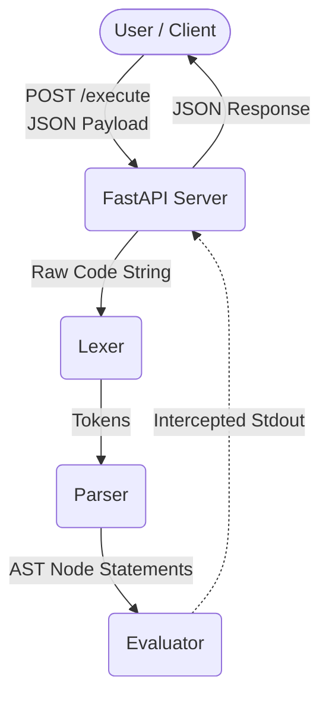

# 🌴 Riri Lang (End-to-End System) 🐵

Riri Lang is a custom programming language playground built with a "Jungle Context" in mind. Originally a lexical parser and interpreter with a UI toolkit, this project has been upgraded into a fully containerized **Cloud API execution environment**.

## Architecture Overview
The system relies on a FastAPI backend to securely execute the custom ast parsing and interpretation logic. All outputs (stdout) are intercepted and returned as API responses.



## Features
- **Custom Parsing & Lexing**: Fully custom `lexer.py` and `parser.py` supporting conditionals (`if/kotsif`), loops (`skarfalwnontas`), and function definitions (`banana/miaou`).
- **Data Structures**: Supports native Python-equivalent arrays and multidimensional lists `[1, 2, "hello"]` and index lookups `fwnakse(x[0])`.
- **Compiler / Virtual Machine**: Riri_lang AST can be flattened by `compiler.py` into native byte manipulation OpCodes (e.g. `LOAD_CONST`, `ADD`), executing on a high-speed Python Stack Machine (`vm.py`).
- **Advanced Error Tracking**: Syntax and runtime evaluator errors cleanly identify both the `Line` and the `Column` where a failure occurred. 
- **Secure Sandboxing**:
  - The API endpoints implement execution timeouts to prevent infinite `while` loops.
  - The containerized Docker environments run the application as an unprivileged container user (`ririapp`).
- **Structured Logging**: Deep observability with `python-json-logger` emitting structured JSON format logs.
- **CI/CD**: Fully automated unit testing (using `pytest`) and styling constraints (`flake8`, `black`) ran on every GitHub Pull Request or Push via GitHub Actions.

## Getting Started

### 🐳 Running via Docker

The fastest way to spin up the Riri API is using Docker Compose:

```bash
docker-compose up --build -d
```
The server will be hosted on `http://localhost:8000`.

### ⚡ Running Locally (AST Evaluator)
1. Install requirements:
   ```bash
   pip install -r requirements.txt
   ```
2. You can execute scripts by directly invoking the python layer:
   ```bash
   python interpreter.py PITIS_test.doc
   ```

### 🧠 Running Locally (Bytecode Virtual Machine)
Riri Lang features an internal Bytecode Compiler that converts AST trees into native opcodes similar to CPython. To execute a script using the stack-machine backend instead, use the `--vm` flag:
```bash
python interpreter.py PITIS_test.doc --vm
```
If you wish to view the generated Bytecode Instructions mapped alongside your execution, append `--debug-vm`:
```bash
python interpreter.py PITIS_test.doc --vm --debug-vm
```

### 🐵 Starting the API
To launch the FastAPI layer:
```bash
uvicorn server:app --host 0.0.0.0 --port 8000 --reload
```

### 🐒 Exploring the API Context
You can send HTTP requests with a Riri JSON payload containing the Riri application script:

```bash
curl -X POST "http://localhost:8000/execute" \
     -H "Content-Type: application/json" \
     -d '{
           "code": "x = 5\n skarfalwnontas x > 0\n fwnakse(x)\n x = x - 1\n miaou\n",
           "timeout": 2.0
         }'
```

Expected Output:
```json
{
  "output": "5.0\n4.0\n3.0\n2.0\n1.0\n",
  "status": "success",
  "error": null
}
```

### 🌳 Visualizing the AST
You can also request a Mermaid.js diagram representing the parsed Abstract Syntax Tree of any Riri code!

```bash
curl -X POST "http://localhost:8000/ast" \
     -H "Content-Type: application/json" \
     -d '{
           "code": "x = 5 + 3"
         }'
```

Expected Output:
```json
{
  "mermaid": "```mermaid\ngraph TD\nnode_0[\"Program\"]\nnode_1[\"Assign(x)\"]\nnode_2[\"BinOp(+)\"]\nnode_3[\"Number(5)\"]\nnode_4[\"Number(3)\"]\nnode_2 --> node_3\nnode_2 --> node_4\nnode_1 --> node_2\nnode_0 --> node_1\n```",
  "status": "success",
  "error": null
}
```

### 🧪 Running tests
To evaluate that the lexing and parsing mechanisms correctly maintain compatibility:
```bash
pytest -v
```
